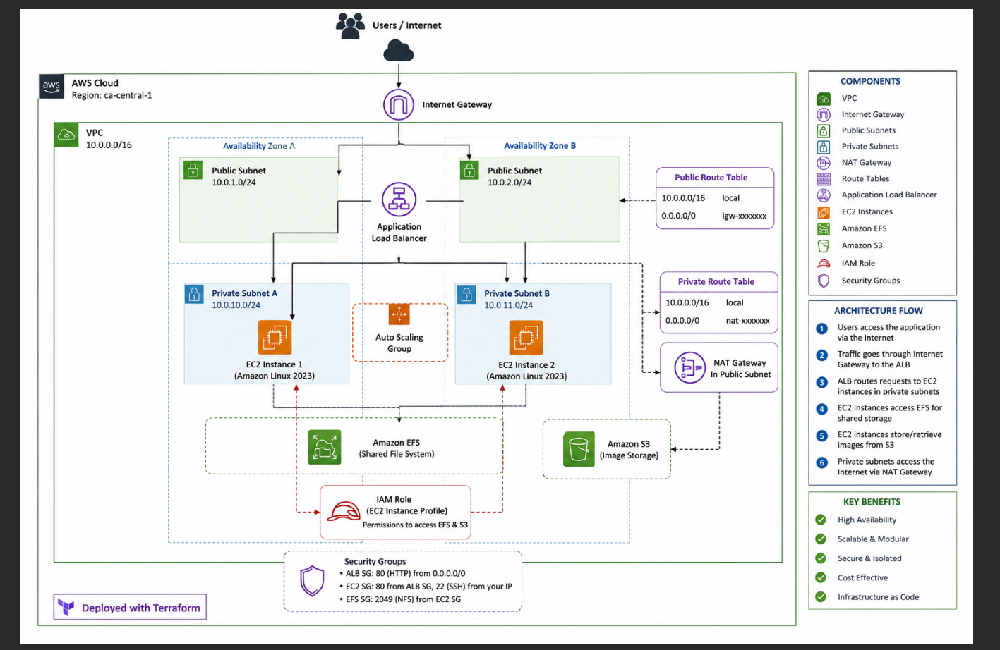
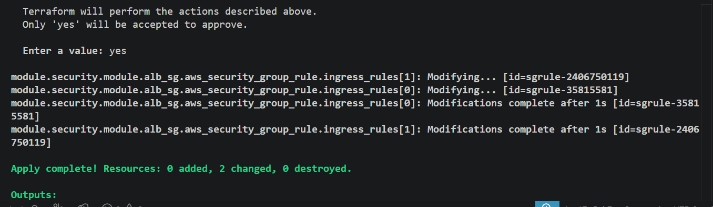
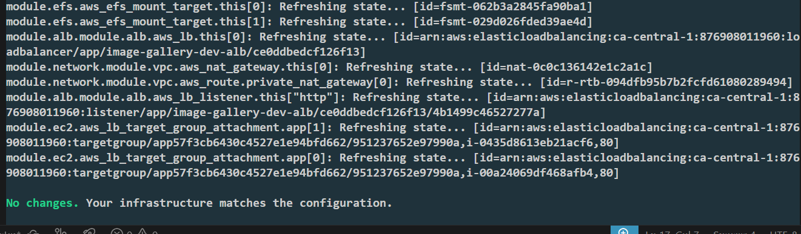
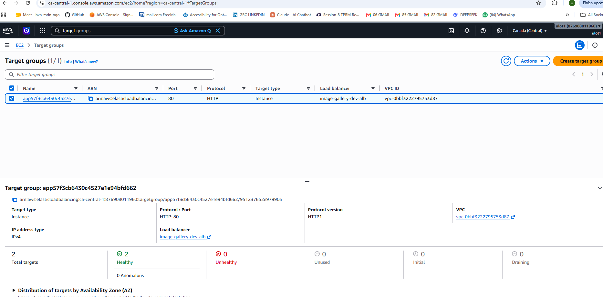
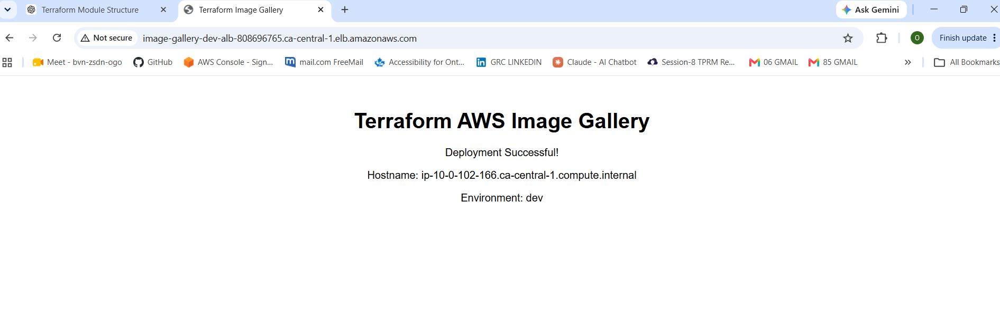
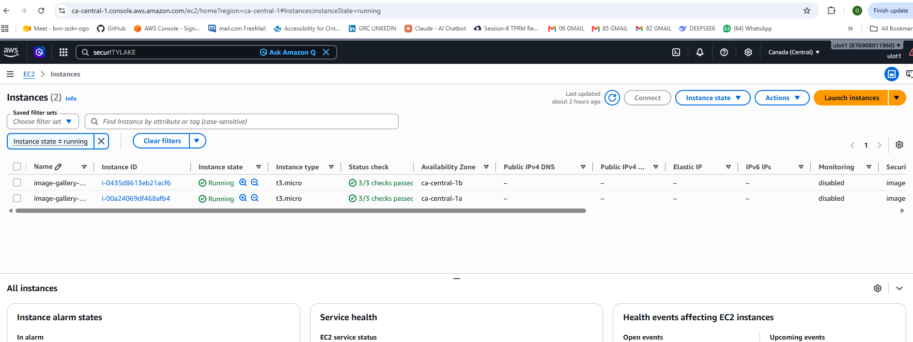
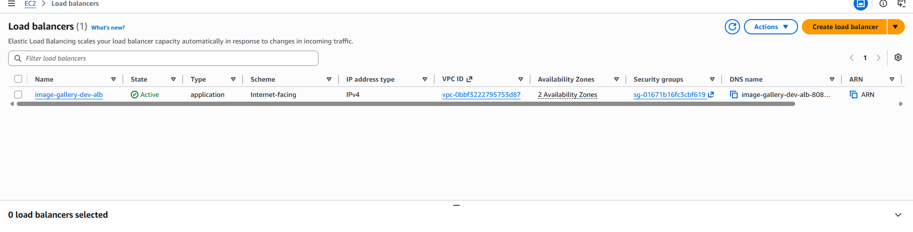
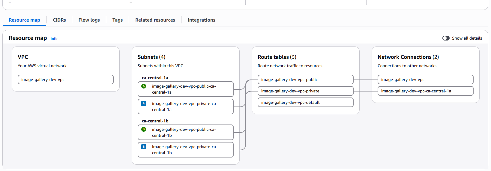

# 🚀 Terraform AWS Image Gallery Infrastructure as Code (IaC)

[](https://github.com/oaolumide1/terraform-aws-image-gallery/actions/workflows/terraform.yml)


---

## 📖 Project Overview

This project demonstrates the deployment of a production-style AWS infrastructure using **Terraform** and Infrastructure as Code (IaC) best practices.

The solution provisions networking, compute, storage, identity management, and load balancing components using reusable Terraform modules.

The infrastructure was deployed successfully on AWS and validated with a clean Terraform state:

```
No changes.
Your infrastructure matches the configuration.
```

---

# 🏗 AWS Architecture



---

# ✨ Features

- Modular Terraform architecture
- Amazon VPC
- Public Subnets
- Private Subnets
- Internet Gateway
- NAT Gateway
- Route Tables
- Application Load Balancer (ALB)
- Amazon EC2
- Amazon EFS
- Amazon S3
- IAM Roles
- IAM Instance Profiles
- Security Groups
- Dynamic Amazon Linux 2023 AMI retrieval using AWS Systems Manager Parameter Store
- EC2 User Data bootstrapping
- Target Group Health Checks

---

# ☁ AWS Services Used

| Service | Purpose |
|----------|---------|
| Amazon VPC | Network isolation |
| EC2 | Application servers |
| ALB | Load balancing |
| Amazon EFS | Shared file system |
| Amazon S3 | Object storage |
| IAM | Secure access management |
| Security Groups | Network security |
| Internet Gateway | Internet connectivity |
| NAT Gateway | Private subnet internet access |
| Route Tables | Traffic routing |
| Systems Manager Parameter Store | Dynamic AMI lookup |

---

# 📂 Repository Structure

```text
terraform-image-gallery/
│
├── architecture/
├── images/
├── modules/
│   ├── alb/
│   ├── ec2/
│   ├── efs/
│   ├── iam/
│   ├── monitoring/
│   ├── network/
│   ├── s3/
│   └── security/
│
├── userdata/
│
├── main.tf
├── outputs.tf
├── providers.tf
├── variables.tf
├── versions.tf
├── terraform.tfvars.example
└── README.md
```

---

# 🚀 Deployment

Clone the repository

```bash
git clone https://github.com/oaolumide1/terraform-aws-image-gallery.git
```

Initialize Terraform

```bash
terraform init
```

Validate

```bash
terraform validate
```

Plan

```bash
terraform plan
```

Deploy

```bash
terraform apply
```

---

# 📊 Outputs

After deployment Terraform provides outputs including:

- ALB DNS Name
- EC2 Instance IDs
- Private IP Addresses
- VPC ID
- Public Subnets
- Private Subnets
- Amazon EFS DNS
- Amazon S3 Bucket Name

---

# 📸 Screenshots

## Successful Deployment



---

## Clean Terraform State



---

## Target Group



---

## Application Running



---

## Amazon EC2



---

## Application Load Balancer



---

## Security Groups



---

# 🧠 Challenges Encountered

During this project several real-world infrastructure issues were encountered and resolved.

### EC2 Key Pair

Resolved missing EC2 Key Pair by creating the required key pair in the correct AWS region.

---

### Dynamic AMI Lookup

Implemented Amazon Linux 2023 dynamic AMI retrieval using AWS Systems Manager Parameter Store instead of hardcoded AMI IDs.

---

### Duplicate Security Group Rules

Resolved duplicate security group rule conflicts by importing existing AWS security group rules into Terraform state.

---

### Terraform State Drift

Recovered infrastructure consistency using Terraform Import until Terraform reported:

```
No changes.
Your infrastructure matches the configuration.
```

---

### Application Load Balancer

Configured ALB listener, target groups, health checks, and security groups to successfully route traffic to EC2 instances.

---

# 📚 Lessons Learned

This project strengthened practical experience with:

- Infrastructure as Code
- Terraform Modules
- AWS Networking
- Security Groups
- IAM
- Load Balancers
- Amazon EFS
- Terraform State Management
- Terraform Import
- EC2 User Data
- Infrastructure Troubleshooting

---

# 🔮 Future Improvements

- Auto Scaling Groups
- Launch Templates
- AWS Certificate Manager (HTTPS)
- Route53
- Remote Terraform State (S3 Backend)
- DynamoDB State Locking
- GitHub Actions CI/CD
- CloudWatch Dashboards
- CloudWatch Alarms
- AWS WAF

---

# 👨‍💻 Author

**Oluwashola Olumide**

Cloud • DevOps • Infrastructure as Code • Terraform • AWS

---