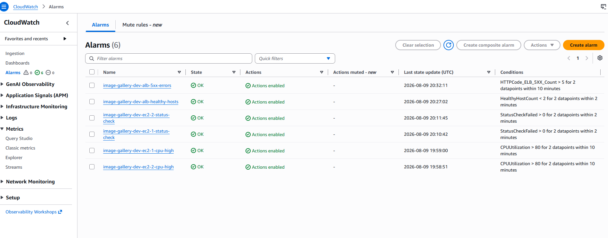
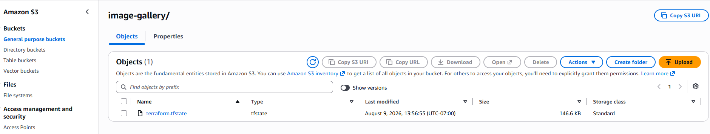
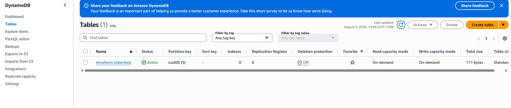
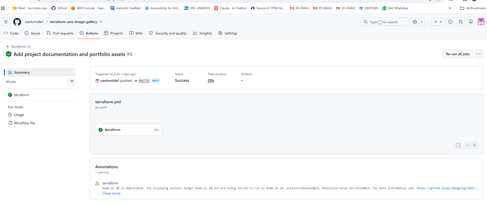

# 🚀 AWS Image Gallery Infrastructure with Terraform

Production-ready AWS Infrastructure as Code (IaC) project built with Terraform, featuring modular architecture, remote state management, monitoring, alerting, and continuous integration.

---


---

## 📖 Project Overview

This project demonstrates the deployment of a production-style AWS infrastructure using **Terraform** and Infrastructure as Code (IaC) best practices.

The solution provisions networking, compute, storage, identity management, and load balancing components using reusable Terraform modules.

The infrastructure was deployed successfully on AWS and validated with a clean Terraform state:

```
No changes.
Your infrastructure matches the configuration.
```

---

# 🏗 AWS Architecture


The solution deploys a highly available AWS infrastructure consisting of a custom VPC, public and private subnets, Application Load Balancer, EC2 instances, EFS shared storage, S3 object storage, IAM roles, CloudWatch monitoring, SNS notifications, and a remote Terraform backend.
---

# ✨ Features

- Modular Terraform architecture
- Amazon VPC
- Public Subnets
- Private Subnets
- Internet Gateway
- NAT Gateway
- Route Tables
- Application Load Balancer (ALB)
- Amazon EC2
- Amazon EFS
- Amazon S3
- IAM Roles
- IAM Instance Profiles
- Security Groups
- Dynamic Amazon Linux 2023 AMI retrieval using AWS Systems Manager Parameter Store
- EC2 User Data bootstrapping
- Target Group Health Checks
- Github Actions CI
- Amazon SNS Notifications
- CloudWatch Alarms
- CloudWatch Dashboard
- Remote Terraform State (Amazon S3 Backend)
- DynamoDB State Locking

---
# 📈 Monitoring & Alerting

The infrastructure includes enterprise-style monitoring and alerting using Amazon CloudWatch and Amazon SNS.

### Monitoring Features

- CloudWatch Dashboard
- EC2 CPU Utilization Alarms
- EC2 Status Check Alarms
- ALB Healthy Host Alarm
- ALB HTTP 5XX Alarm
- Amazon SNS Email Notifications





---
# 🔒 Remote Terraform Backend

Terraform state is stored securely in Amazon S3 with state locking provided by DynamoDB.

Features:

- Remote State Storage
- State Locking
- Versioning
- Encryption
- Team Collaboration Support




---
# ⚙️ Continuous Integration

GitHub Actions automatically performs:

- terraform fmt
- terraform validate


---
# 🧩 Key Engineering Decisions

- Used a modular Terraform architecture to improve reusability and maintainability.
- Configured a remote Terraform backend with Amazon S3 and DynamoDB to support collaborative state management.
- Implemented CloudWatch alarms and Amazon SNS notifications for operational monitoring.
- Retrieved the latest Amazon Linux 2023 AMI dynamically using AWS Systems Manager Parameter Store instead of hardcoded AMI IDs.
- Used GitHub Actions to automatically validate Terraform code on every push.
---
# ☁ AWS Services Used

| Service | Purpose |
|----------|---------|
| Amazon VPC | Network isolation |
| EC2 | Application servers |
| ALB | Load balancing |
| Amazon EFS | Shared file system |
| Amazon S3 | Object storage |
| IAM | Secure access management |
| Security Groups | Network security |
| Internet Gateway | Internet connectivity |
| NAT Gateway | Private subnet internet access |
| Route Tables | Traffic routing |
| Systems Manager Parameter Store | Dynamic AMI lookup |

---

# 📂 Repository Structure

```text
terraform-image-gallery/
│
├── architecture/
├── images/
├── modules/
│   ├── alb/
│   ├── ec2/
│   ├── efs/
│   ├── iam/
│   ├── monitoring/
│   ├── network/
│   ├── s3/
│   └── security/
│
├── userdata/
│
├── main.tf
├── outputs.tf
├── providers.tf
├── variables.tf
├── versions.tf
├── terraform.tfvars.example
└── README.md
```

---

# 🚀 Deployment

Clone the repository

```bash
git clone https://github.com/oaolumide1/terraform-aws-image-gallery.git
```

Initialize Terraform

```bash
terraform init
```

Validate

```bash
terraform validate
```

Plan

```bash
terraform plan
```

Deploy

```bash
terraform apply
```

---

# 📊 Outputs

After deployment Terraform provides outputs including:

- ALB DNS Name
- EC2 Instance IDs
- Private IP Addresses
- VPC ID
- Public Subnets
- Private Subnets
- Amazon EFS DNS
- Amazon S3 Bucket Name

---

# 📸 Screenshots

## Successful Deployment


---

## Clean Terraform State


---

## Target Group


---

## Application Running


---

## Amazon EC2


---

## Application Load Balancer


---

## Security Groups


---

# 🧠 Challenges Encountered

During this project several real-world infrastructure issues were encountered and resolved.

### EC2 Key Pair

Resolved missing EC2 Key Pair by creating the required key pair in the correct AWS region.

---

### Dynamic AMI Lookup

Implemented Amazon Linux 2023 dynamic AMI retrieval using AWS Systems Manager Parameter Store instead of hardcoded AMI IDs.

---

### Duplicate Security Group Rules

Resolved duplicate security group rule conflicts by importing existing AWS security group rules into Terraform state.

---

### Terraform State Drift

Recovered infrastructure consistency using Terraform Import until Terraform reported:

```
No changes.
Your infrastructure matches the configuration.
```

---

### Application Load Balancer

Configured ALB listener, target groups, health checks, and security groups to successfully route traffic to EC2 instances.

---

# 📚 Lessons Learned

This project strengthened practical experience with:

- Infrastructure as Code
- Terraform Modules
- AWS Networking
- Security Groups
- IAM
- Load Balancers
- Amazon EFS
- Terraform State Management
- Terraform Import
- EC2 User Data
- Infrastructure Troubleshooting

---

# 🔮 Future Improvements

- Auto Scaling Groups
- Launch Templates
- AWS Certificate Manager (HTTPS)
- Route53
- AWS WAF
- AWS Secrets Manager
- Auto Scaling Policies
- Multi-Environment Support (dev, stage, prod)

---
# 📊 Project Summary

- 8 Terraform Modules
- 30+ AWS Resources
- Remote Backend (S3 + DynamoDB)
- GitHub Actions CI
- CloudWatch Monitoring
- Amazon SNS Alerting
- Infrastructure as Code (IaC)
---

# 👨‍💻 Author

**Oluwashola Olumide**

Cloud • DevOps • Infrastructure as Code • Terraform • AWS

---